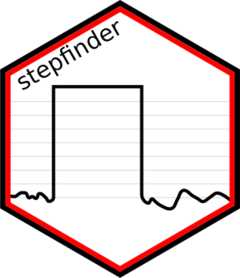
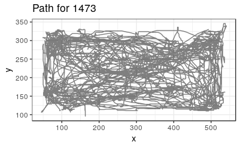
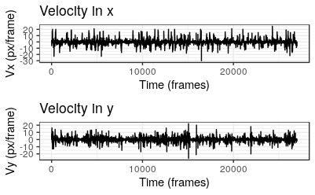
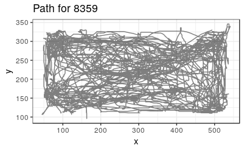
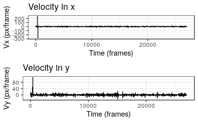
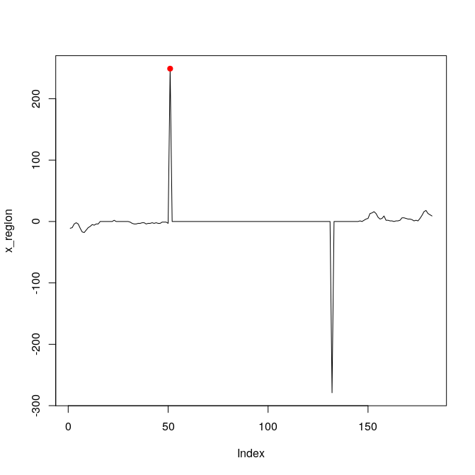
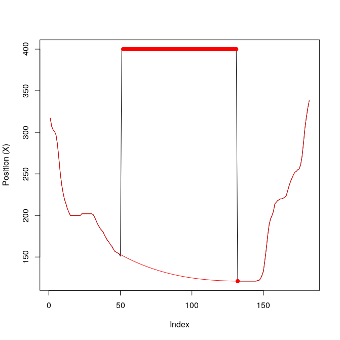
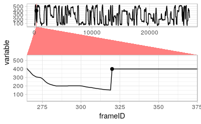
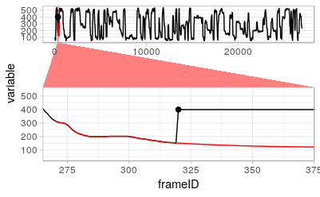

```{r, include = FALSE}
knitr::opts_chunk$set(
  collapse = TRUE,
  comment = "#>",
  fig.path = "man/figures/README-",
  out.width = "100%"
)
```
# stepfinder



<!-- badges: start -->
<!-- badges: end -->

The goal of `stepfinder` is to detect a step in one dimensional data. 

## Installation

**This package is yet to be released on CRAN.**
In the future, you will be able to install the released version of stepfinder from [CRAN](https://CRAN.R-project.org) with:

``` r
install.packages("stepfinder")
```

For now, install the development version from [GitHub](https://github.com/) with:

``` r
# install.packages("devtools")
devtools::install_github("matiasandina/stepfinder")
```

## Usage

> This package contains a semi-automated pipeline. This means the user will be prompted several times and should be familiar with the pipeline.

> Although these functions should work for any type of 1 dimensional data, there are a good number of references to animals. This is because the package was developed for detection of steps during tracking of animal positions.

### Data diagnostics

```{r example}
library(stepfinder)
```

Minimally, you would have a `data.frame` with 3 columns `frameID`, `x`, `y`. The first idea is to inspect the detections. The package provides examples under `data`. 

```{r load-data}
# load data from github
# df <- read.csv("https://raw.githubusercontent.com/matiasandina/stepfinder/master/data/sample_detection.csv")
# or from package .Rdata
head(sample_detection)
```

```{r diagnose-detection, eval=FALSE}
diagnostic <- diagnose_detection(sample_detection)
```

> If your data does not have an `id` column, random IDs will be assigned on each run of `diagnose_detection()`.

```{r, echo=FALSE, comment=NA}

message("No id found, assigning random id.\nInternal id assignment is not reproducible, if IDs matter assign IDs beforehand!
")

```

You are prompted to see plots and diagnose whether detections were correct. 

```{r print-path, echo=FALSE, comment=NA}
message("Press [enter] to see animal path: >")
```



And to see the velocity plots.

```{r, echo=FALSE, comment=NA}
message("Press [enter] to see diagnostics: >")
```



Finally, you have to answer whether the detection was good or bad.

```{r, echo=FALSE, comment=NA}
message("Detection was correct [Yy/Nn]: >")
```

Here's an example of a wrong detection (Prompts not included).

```{r wrong-detection, eval=FALSE}
# read data from GitHub
df_wrong <- read.csv("https://raw.githubusercontent.com/matiasandina/stepfinder/master/data/sample_wrong_detection.csv")
# or just from package .Rdata
diagnostic <- diagnose_detection(sample_wrong_detection)

```



The path does not make it clear that there were wrong detections. However, the errors are evident in velocity plots.



These plots also give a good estimate for the velocity we will set up as threshold for bad detections (see `v_thresh` in `?fix_detection_jumps`).

The idea is to do this process for multiple detections and later filter out those that need to be fixed.

You can easily run multiple detections wrapping the `diagnose_detection` in an `lapply` call. This applies to all the functions of the package. 

```{r multiple-diagnostic, eval=FALSE}
# Make list of dfs
list_of_df <- list(df, df_wrong)

lapply(list_of_df, function(t) diagnose_detection(t))

```

### Fixing detections

The workhorse for fixing detections is `fix_detection_jumps`. This function will print a good amount of info about possible wrong detections (those `xy` with `abs(diff(xy)) > v_thresh`). Because we are looking for steps, every bad detection should have a companion. Thus, `fix_detection_jumps` will call `cluster_candidate_list` to attempt to cluster possible bad detections in pairs. Later on, it will prompt the user for proper removal and interpolation of steps. See `?fix_detection_jumps`. Basic example below.

### Convolution

The default uses derivatives to find the possible candidates and convolution to find whether there's a step around the candidates. Convolution is implemented through `find_step()`. 

```{r fix-detections, eval=FALSE}
fixed_data <- fix_detection_jumps(sample_wrong_detection)
```

Info will be printed for `x` and `y`, only `x` is presented below.

```
We found 4 possible candidates...
```
```{r fix-print-1, echo=FALSE, comment=NA}
print("This clusters were found...")
print(c(1, 1, 2))
```

```
  positions x_clust diff_val
1       320       1      249
2       401       1     -279
3     16483       2      -30
```

We are looking for detections that have high difference (in this case diff_val ~ 250), opposite sign, and come in pairs. Positions 320 and 401 look like an actual step, the other one looks like a genuine high velocity. 

```
Inspecting positions in x
Press [enter] to see velocity plots: > 
```


We can see that the spikes in velocity are artificial. We could skip removal (1) but would like to remove them (2).

```
Diagnose detection:
Good Detection --> Keep or Bad Detection --> Remove?? [(1/2)]: >
```

```
Using convolution to find step.
Derivate goes positive to negative,
Prediction is step-up
Analyzing position close to bad detections
```



Finally, the user will still have the last say whether to replace data or not.

```
Are you happy with interpolation [Yy/Nn]? : >
```

If you liked the interpolation (and entered 'y'), you will see:

```
Modifying data...
```

### Just derivatives

Sometimes, convolution can't detect steps. In that case, we can just try to use the candidates from derivatives. This works most of the time and might be the default behavior in next versions of the package.

```{r fix-detections-derivatives, eval=FALSE}
fixed_detections <- fix_detection_jumps(sample_wrong_detection, use_convolution = FALSE)
```

Procedure is almost identical to before, but you will see.

```
No convolution.
Finding steps from derivatives
Analyzing position close to bad detections
```

### Manual

Sometimes, you have to go full manual. 

```{r fix-detections-manual, eval=FALSE}
fix_detection_jumps(df_wrong, manual_removal = TRUE)
```

```
We found 4 possible candidates...
Entering manual mode....
Analyze x
Diagnose detection:
```


```
Good Detection --> Keep or Bad Detection --> Remove?? [(1/2)]: >
```
When you try to remove (2), you will see:

```
Select range from possible candidates.
320   401 16483
```
We know that 401 is the one we need to select (the length of the `data.frame` is included in the candidates for the very special case in which a step is detected until the end of the data).


```
Analyzing position close to bad detections
```



```
Are you happy with interpolation [Yy/Nn]? : >
```


## Contribute

This is a preliminary release. Please file issues to make this software work better.
