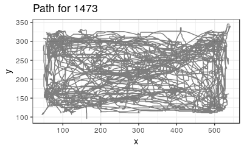

# stepfinder


<!-- badges: start -->

<!-- badges: end -->

The goal of `stepfinder` is to detect a step in one dimensional data.

## Installation

**This package is yet to be released on CRAN.** In the future, you will
be able to install the released version of stepfinder from
[CRAN](https://CRAN.R-project.org) with:

``` r
install.packages("stepfinder")
```

For now, install the development version from
[GitHub](https://github.com/) with:

``` r
# install.packages("devtools")
devtools::install_github("matiasandina/stepfinder")
```

## Usage

> This package contains a semi-automated pipeline. This means the user
> will be prompted several times and should be familiar with the
> pipeline.

> Although these funcitons should work for any type of 1 dimensional
> data, there are a good number of references to animals. This is
> because the package was developed for detection of steps during
> tracking of animal positions.

### Data diagnostics

``` r
library(stepfinder)
#> Loading required package: ggplot2
#> Loading required package: dplyr
#> 
#> Attaching package: 'dplyr'
#> The following objects are masked from 'package:stats':
#> 
#>     filter, lag
#> The following objects are masked from 'package:base':
#> 
#>     intersect, setdiff, setequal, union
```

Minimally, you would have a `data.frame` with 3 columns `frameID`, `x`,
`y`. The first idea is to inspect the detections. The package provides
examples under `data`.

``` r
# load data
df <- read.csv("data/df.csv")
head(df)
#>   frameID  x   y
#> 1       1 93 111
#> 2       2 95 111
#> 3       3 96 111
#> 4       4 95 111
#> 5       5 95 111
#> 6       6 95 111
```

``` r
diagnostic <- diagnose_detection(df)
```

> If your data does not have an `id` column, random IDs will be assigned
> on each run of `diagnose_detection()`.

    No id found, assigning random id.
    Internal id assignment is not reproducible, if IDs matter assign IDs beforehand!

You are prompted to see plots and diagnose whether detections were
correct.

    Press [enter] to see animal path: >



And to see the velocity plots.

    Press [enter] to see diagnostics: >


Finally, you have to answer whether the detction was good or bad.

    Detection was correct [Yy/Nn]: >

Here’s an example of a wrong detection (Prompts not included).

``` r
# read data
df_wrong <- read.csv("data/df_wrong.csv")
diagnostic <- diagnose_detection(df_wrong)
```


The path does not make it clear that there were wrong detections.
However, the errors are evident in velocity plots.


These plots also give a good estimate for the velocity we will set up as
threshold for bad detections (see `v_thresh` in `?fix_detection_jumps`).

The idea is to do this process for multiple detections and later filter
out those that need to be fixed.

You can easily run multiple detections wrapping the `diagnose_detection`
in an `lapply` call. This applies to all the functions of the package.

``` r
# Make list of dfs
list_of_df <- list(df, df_wrong)

lapply(list_of_df, function(t) diagnose_detection(t))
```

### Fixing detections

The workhorse for fixing detections is `fix_detection_jumps`. See
`?fix_detection_jumps`. Basic example below.

### Convolution

The default uses derivatives to find the possible candidates and
convolution to find whether there’s a step around the candidates.
Convolution is implemented through `find_step()`.

``` r
fix_detection_jumps(df)
```

### Just derivatives

### Manual

Sometimes, you have to go full manual.

``` r
fix_detection_jumps(df_wrong, manual_removal = TRUE)
```
